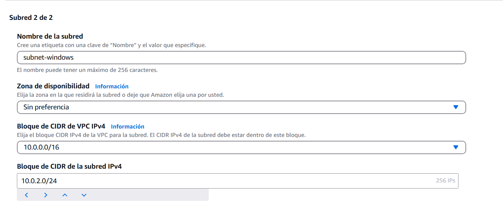
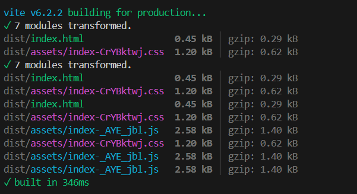

# CREAR UNA VPC EN AWS


Configutamos la VPC con:
- Nombre "mi-vpc-Francsico-Cano." 
- el CIDR Block: 10.0.0.0/16

## CREACION DE UNA SUDRET


Escogeremos el id de la VPC creada anteriormente


la configuracion de la primera subred sera la siguiente:
- nombre: "subnet-linux"
- CIDR: 10.0.1.0/24




Para la configuracion de la segunda subred, volveremos a escoger el id de la VPC creada anteriormente y su configuracion sera la siguiente:

- nombre: "subnet-windows:"
- CIDR: 10.0.2.0/24

## CREACION DE UNA INTERNET GATEWAY

 

Para la cmfiguracion de la gateway le pondremos un nombre y 


y a continuacion la conectaremos a la VPC

## TABLA DE ENRUTAMINETO


Configuramos la tabla de enrutamiento con: 
 nombre; "tabla-rut-Francisco-Cano" y la 
 


Editaremos la ruta con una en (0.0.0.0/0) y el destino "pueta de enlace internet"
 
# EC2 CREACION DE INSTANCIAS (UBUNTU)


Para empezar la configuracion pondremos:

- nombre: Instancia-Francisco-Cano
- imagen de SO: ubuntu


Para la imagen dejaremos la predeterminada en la configuracion


Creamos el par de claves y la guardmos en nuestro ordenador


Los primeros pasos del apartado de la configuracion de la red es , enlazarlo a la VPC (vendra directamente en la congiguracion) y la subred que deseemos, en este caso "Subnet-linux"

### CUANDO VOY A CONECTAR ATRA VEZ DE SSH ME ERROR , Y ME PASA LO MISMO AL CONECTARLA DESDE LA AMAZON SERVICE, HE ESTADO MIRANDO PASO POR PASO POR SI HABIA ALGUN ERROR Y NO SOY CAPAZ DE ENCONTRARLO


# SECURITY GROUPS AWS 


Empezamos con la configuracion de el grupo de seguridad poniendole un nombre: server-group-Francisco-Cano, y enlazando la VPC deseada


En las reglas de entrada pondremos estas configuraciones 


Y en la de salida estas configuraciones

# PROYECYO VITE


Para empezar un proyecto vite usaremos el comando

```
npm init vite@latest .

```

Le escogeremos un nombre en este caso: web-francisco-cano

A continuacion escogeremos el framework: vanilla, y variant: Javascript


Despues de esta configuracion , lo instalaremos con el comando:
```
npm install
```

Con el comando:
```
npm build
```
Nos dara los archivos creados , en nuestro proyecto vite


Por ultimo con el comando: 
```
npm run dev 
```
Optendremos la direccion para conectarnos a nuestra pagina.


Aqui podemos ver como qeudaria la pagina web dps de editarla

## EL APARTADO DEL PROYECTO VITE LO HE TENIDO QUE HACER DENTRO DE ESTE PROYECTO YA QUE LA PARTE FINAL DE LA CREACION DE L A INSTANCIA ME DA ERROR Y HE PREFERIDO HACERLO AQUI PARA QUE PUEDAS VER AUNQUE SEA QUW SW HACERLA

# PULL REQUEST


Primero clonaremos el reposirotio de nuestro compañero en nuestro equipo y le crearemos unas nueva rama.


En esta nuevca rama modificamos el documento para hacerle la mejora, en este caso le hemos mejorado el tirulo del documento.


Cuando terminemos de hacer las modificacion guardaremos la informacion y haremos un commit.

Despues de esto haremos un push a GitHub.


Por ultimos aremos el push request donde comentaremos los modificaciones que hemos hecho y el compañero las tendra que aceptar 
