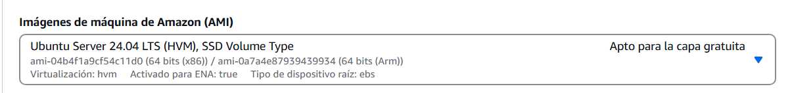

# CREAR UNA VPC EN AWS

Configutamos la VPC con:
- Nombre "mi-vpc-Francsico-Cano." 
- el CIDR Block: 10.0.0.0/16

## CREACION DE UNA SUDRET

Escogeremos el id de la VPC creada anteriormente

la configuracion de la primera subred sera la siguiente:
- nombre: "subnet-linux"
- CIDR: 10.0.1.0/24

Para la configuracion de la segunda subred, volveremos a escoger el id de la VPC creada anteriormente y su configuracion sera la siguiente:

- nombre: "subnet-windows:"
- CIDR: 10.0.2.0/24

## CREACION DE UNA INTERNET GATEWAY

 

Para la cmfiguracion de la gateway le pondremos un nombre y 

y a continuacion la conectaremos a la VPC

## TABLA DE ENRUTAMINETO

Configuramos la tabla de enrutamiento con: 
 nombre; "tabla-rut-Francisco-Cano" y la 
 

Editaremos la ruta con una en (0.0.0.0/0) y el destino "pueta de enlace internet"
 
# EC2 CREACION DE INSTANCIAS (UBUNTU)

Para empezar la configuracion pondremos:

- nombre: Instancia-Francisco-Cano
- imagen de SO: ubuntu

Para la imagen dejaremos la predeterminada en la configuracion

Creamos el par de claves y la guardmos en nuestro ordenador

Los primeros pasos del apartado de la configuracion de la red es , enlazarlo a la VPC (vendra directamente en la congiguracion) y la subred que deseemos, en este caso "Subnet-linux"

# EC2 CREACION DE INSTANCIAS (WINDOW)

Empezamos la configuracion poniendo nombre y SO deseaso, en este caso ahora escogeremos window y de imagen la predeterminada por el programa

En el tipo de instancia escogeremos en este caso: t3.medium

haremos un nuevo par de claves para esta instancia

de esta forma configuraremos las reglas de salida

Y de esta formas las de entrada 

# SECURITY GROUPS AWS 

Empezamos con la configuracion de el grupo de seguridad poniendole un nombre: server-group-Francisco-Cano, y enlazando la VPC deseada

En las reglas de entrada pondremos estas configuraciones 

Y en la de salida estas configuraciones

